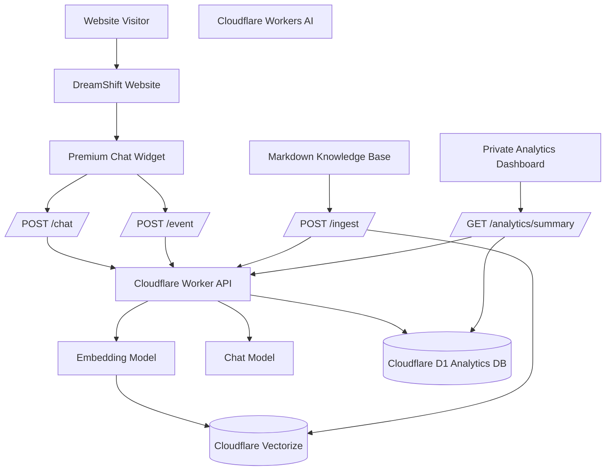
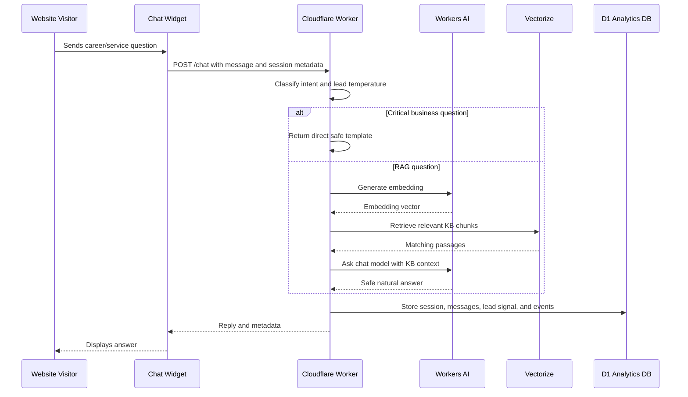
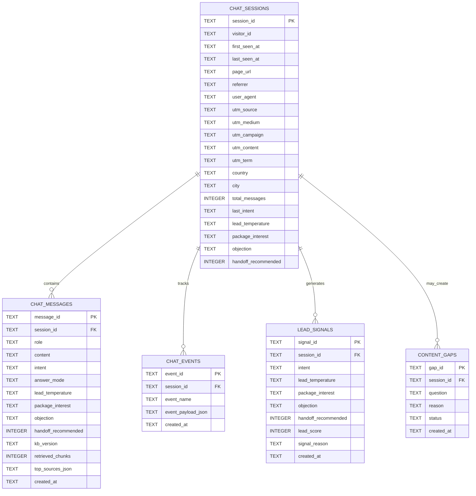

# Live AI Chatbot for DreamShift


A serverless AI customer support and lead intelligence platform combining RAG, vector search, D1 analytics, event tracking, and prescriptive business insights for DreamShift.

This project goes beyond a simple chatbot. It combines:

* retrieval-augmented generation, also known as RAG,
* Cloudflare Workers AI,
* Vectorize-powered semantic search,
* D1-based conversation storage,
* event tracking,
* lead scoring,
* UTM attribution,
* content gap detection,
* and a private analytics dashboard for business decision-making.

Built and engineered by **Navodhya Fernando**.

---

## What This Project Does

The DreamShift chatbot helps website visitors understand career support services such as:

* Resume/CV writing
* Cover letter writing
* LinkedIn optimisation
* ATS keyword research
* job search strategy
* job application support
* package pricing
* instalments
* consultation booking
* guarantee and refund conditions

At the same time, it captures meaningful business intelligence from every conversation.

The system identifies:

* what users are asking,
* which users show buying intent,
* what objections they have,
* which campaigns generate stronger leads,
* which CTAs users click,
* and what knowledge base gaps should be fixed.

---

## Features

* **Smart RAG Chatbot:** Uses Cloudflare Workers AI and Vectorize to answer service, package, pricing, and career-support questions from DreamShift’s structured knowledge base.
* **Business-Safe Direct Answers:** Uses direct templates for critical topics such as pricing, packages, refunds, guarantees, instalments, and urgent delivery.
* **Lead Intelligence Engine:** Detects intent, buying signals, objections, lead temperature, package interest, and recommended handoff actions.
* **Conversation Storage:** Stores sessions, messages, CTA events, lead signals, and content gaps in Cloudflare D1.
* **Event Tracking:** Tracks chat opens, quick-action clicks, WhatsApp clicks, booking/contact clicks, and general chat interactions.
* **Private Analytics Dashboard:** Converts chatbot activity into simple, business-friendly insights for non-technical stakeholders.
* **Prescriptive Recommendations:** Generates next-best-action suggestions such as improving CTAs, updating knowledge base gaps, and prioritising hot leads.
* **UTM Attribution:** Captures campaign source, medium, campaign, content, and term data for marketing performance analysis.
* **Premium Frontend Widget:** Branded floating chatbot using DreamShift’s colour palette and mobile-responsive UI.
* **Serverless Deployment:** Runs on Cloudflare Workers with no traditional server management.

---

## Benefits

* Converts chatbot conversations into measurable sales intelligence.
* Helps the team identify high-intent leads faster.
* Shows which questions and objections appear most often.
* Connects lead behaviour with UTM source and campaign data.
* Improves knowledge base quality through content gap detection.
* Provides a scalable AI support layer without traditional server infrastructure.
* Demonstrates practical use of AI engineering, data analytics, and software engineering in one project.

---

## Tech Stack

### Core Platform

* Cloudflare Workers
* Cloudflare Workers AI
* Cloudflare Vectorize
* Cloudflare D1
* Wrangler CLI

### Language and Runtime

* JavaScript
* Serverless edge runtime
* REST-style API routes

### AI and Data Layer

* Embedding model: `@cf/baai/bge-small-en-v1.5`
* Chat model: `@cf/meta/llama-3.1-8b-instruct`
* Vector database: Cloudflare Vectorize
* Relational analytics database: Cloudflare D1 / SQLite

### Frontend

* HTML
* CSS
* Vanilla JavaScript
* LocalStorage-based visitor/session continuity
* Mermaid diagrams in documentation

### Analytics Methods

* intent classification
* lead scoring
* segmentation
* funnel analysis
* CTA event tracking
* UTM attribution
* content gap mining
* rule-based next-best-action recommendations
* daily trend analysis

---

## Why This Project Reflects My Engineering Profile

This project combines **software engineering**, **AI engineering**, and **data analytics** in a production-oriented system.

### Software Engineering

* Designed and implemented a serverless edge architecture.
* Built multiple API routes for chat, ingestion, event tracking, and analytics.
* Created secure admin-only analytics access using Worker secrets.
* Designed a relational D1 schema for conversation intelligence.
* Implemented frontend session tracking and CTA event capture.
* Built a deployable website widget and private dashboard UI.
* Used environment-driven configuration and secret management.

### AI Engineering

* Implemented RAG using Workers AI embeddings and Vectorize.
* Designed a knowledge base ingestion and chunking pipeline.
* Added intent-aware semantic retrieval.
* Combined direct-answer templates with RAG for safer business-critical responses.
* Added guardrails to prevent hallucinations around pricing, refunds, jobs, visas, and urgent delivery.
* Used metadata and source categories to improve retrieval relevance.

### Data Science and Analytics

* Designed the lead intelligence data model.
* Built descriptive analytics for chatbot usage.
* Built diagnostic analytics for objections, intents, and campaign performance.
* Added rule-based prescriptive analytics for recommended business actions.
* Created a lead scoring framework based on intent, CTA actions, objections, and buying signals.
* Built content gap detection to improve the knowledge base over time.
* Prepared the system for future predictive lead scoring and forecasting once enough conversion data is available.

---

## System Architecture



---

## AI Response Flow



---

## Analytics Data Model



---

## Analytics Techniques Used

| Analytics Type         | Current Use                               | Techniques                                                                             |
| ---------------------- | ----------------------------------------- | -------------------------------------------------------------------------------------- |
| Descriptive Analytics  | Shows what happened in the chatbot        | counts, percentages, top-N analysis, daily trends                                      |
| Diagnostic Analytics   | Explains why leads behave in certain ways | intent analysis, objection analysis, campaign segmentation, CTA comparison             |
| Prescriptive Analytics | Recommends what the team should do next   | rule-based next-best-action logic, content gap prioritisation, handoff recommendations |
| Predictive Analytics   | Planned future layer                      | conversion probability, lead propensity scoring, likely package interest               |
| Forecasting            | Planned future layer                      | hot lead forecasting, demand trends, campaign lead volume forecasting                  |

The current system already supports **descriptive**, **diagnostic**, and **rule-based prescriptive** analytics.

Predictive analytics and forecasting can be added once enough labelled business outcomes are connected, such as:

* consultation booked,
* WhatsApp lead contacted,
* Tally form submitted,
* Airtable lead status,
* package purchased,
* Stripe payment completed,
* client converted.

---

## Dashboard Metrics

The private analytics dashboard shows:

* total conversations
* user messages
* hot leads
* handoff rate
* WhatsApp clicks
* booking/contact clicks
* top user intents
* top objections
* package interest
* CTA activity
* recent hot leads
* campaign/source performance
* content gaps
* daily trends
* recommended business actions

Example prescriptive insight:

```text
Insight:
Hot leads are appearing, but booking/contact clicks are low.

Recommended action:
Show the start.dreamshift.net CTA after pricing, package, and consultation questions.
```

---

## API Routes

### Health Check

```http
GET /
```

Returns:

```text
DreamShift Bot up
```

### Chat Route

```http
POST /chat
```

Example body:

```json
{
  "message": "What packages do you offer?",
  "session_id": "sess_123",
  "visitor_id": "visitor_123",
  "page_url": "https://dreamshift.net",
  "utm_source": "google",
  "utm_medium": "cpc",
  "utm_campaign": "cv_australia"
}
```

### Event Tracking Route

```http
POST /event
```

Tracks frontend actions such as:

* `chat_opened`
* `quick_action_clicked`
* `whatsapp_clicked`
* `booking_clicked`
* `contact_clicked`

Example body:

```json
{
  "event_name": "whatsapp_clicked",
  "session_id": "sess_123",
  "visitor_id": "visitor_123",
  "page_url": "https://dreamshift.net",
  "utm_source": "google",
  "utm_medium": "cpc",
  "utm_campaign": "cv_australia"
}
```

### Knowledge Base Ingestion

```http
POST /ingest
```

Requires:

```http
x-ingest-key: <INGEST_KEY>
```

Used by the ingestion script to upload markdown KB chunks into Vectorize.

### Analytics Summary

```http
GET /analytics/summary?days=30
```

Requires:

```http
x-admin-key: <ADMIN_KEY>
```

Returns dashboard-ready business intelligence:

* overview KPIs
* top intents
* top objections
* package interest
* event counts
* campaign/source performance
* daily trends
* recent hot leads
* content gaps
* recommendations

---

## Repository Structure

```text
Live-AI-Chatbot-for-DreamShift/
  frontend/
    popup.html              # Premium website chatbot widget
    dashboard.html          # Private analytics dashboard

  kb/
    00-brand-and-chatbot-rules.md
    00a-critical-business-facts.md
    01-services.md
    02-packages-and-pricing.md
    03-guarantee-refunds-revisions-terms.md
    04-client-process.md
    05-australia-job-search-guidance.md
    06-industries-and-client-proof.md
    07-faqs.md
    08-sales-objections-and-replies.md
    09-lead-qualification-and-handoff.md
    10-content-gap-and-dashboard-tags.md
    11-confirmed-sales-team-objections.md

  migrations/
    0001_chat_analytics.sql

  scripts/
    ingest.mjs              # KB ingestion script

  src/
    index.js                # Worker routes, RAG logic, analytics API

  wrangler.toml
  package.json
  README.md
```

---

## Environment Variables and Secrets

### Local `.env`

```env
WORKER_URL=https://dreamshift-bot.dreamshift-kb.workers.dev
INGEST_KEY=<your-ingest-key>
ADMIN_KEY=<your-admin-key>
```

### Cloudflare Worker Secrets

```bash
npx wrangler secret put INGEST_KEY
npx wrangler secret put ADMIN_KEY
```

### D1 Binding

Example `wrangler.toml` block:

```toml
[[d1_databases]]
binding = "dreamshift_ai_db"
database_name = "dreamshift-ai-db"
database_id = "<database-id>"
migrations_dir = "migrations"
```

Other bindings used by the Worker:

```text
env.AI
env.VEC
env.dreamshift_ai_db
```

---

## Quick Start

### Prerequisites

* Node.js 18+
* npm
* Cloudflare account
* Wrangler CLI
* Cloudflare Workers AI enabled
* Cloudflare Vectorize index
* Cloudflare D1 database

### Install Dependencies

```bash
npm install
```

### Apply D1 Migrations

```bash
npx wrangler d1 migrations apply dreamshift-ai-db --remote
```

### Deploy Worker

```bash
npx wrangler deploy
```

### Ingest Knowledge Base

```bash
node scripts/ingest.mjs
```

### Test Chat

```bash
curl -X POST "$WORKER_URL/chat" \
  -H "Content-Type: application/json" \
  -d '{
    "message":"Can you apply for jobs for me?",
    "session_id":"test_session_001",
    "page_url":"https://dreamshift.net",
    "utm_source":"manual_test"
  }'
```

### Test Event Tracking

```bash
curl -X POST "$WORKER_URL/event" \
  -H "Content-Type: application/json" \
  -d '{
    "event_name":"whatsapp_clicked",
    "session_id":"analytics_test_001",
    "visitor_id":"visitor_analytics_test_001",
    "page_url":"https://dreamshift.net/?utm_source=google&utm_medium=cpc&utm_campaign=cv_australia",
    "utm_source":"google",
    "utm_medium":"cpc",
    "utm_campaign":"cv_australia"
  }'
```

### Test Analytics

```bash
curl "$WORKER_URL/analytics/summary?days=30" \
  -H "x-admin-key: $ADMIN_KEY"
```

---

## Key Application Areas

* AI website assistant
* career-service lead qualification
* package and pricing explanation
* support automation
* sales handoff intelligence
* UTM campaign attribution
* content gap discovery
* private analytics dashboard
* business decision support

---

## Security and Access Notes

* Ingestion is protected by `INGEST_KEY`.
* Analytics is protected by `ADMIN_KEY`.
* Worker secrets are managed through Cloudflare Wrangler.
* Frontend dashboard should remain private.
* Admin keys should never be committed to GitHub.
* The chatbot avoids giving migration or visa advice.
* The chatbot does not promise jobs, hiring outcomes, PR outcomes, or urgent delivery without confirmation.

---

## Future Roadmap

### Predictive Analytics

Once enough labelled lead outcomes are available, the system can support:

* lead conversion probability
* likelihood of WhatsApp click
* likelihood of booking/contact form submission
* likely package interest
* lost-lead risk
* campaign lead quality prediction

Possible modelling approaches:

* logistic regression
* random forest
* gradient boosting
* propensity scoring

### Forecasting

Once consistent time-series data is collected, the system can support:

* expected chatbot sessions next week
* expected hot leads next month
* expected WhatsApp clicks
* expected booking/contact clicks
* expected Ultimate Package demand

Possible techniques:

* moving averages
* exponential smoothing
* ARIMA/SARIMA
* Prophet-style forecasting

### Integrations

Potential next integrations:

* Tally form submissions
* Airtable lead status
* Stripe payment data
* Google Analytics 4
* Google Ads campaign data
* Meta/TikTok/LinkedIn attribution
* automated sales notifications

---

## Project Highlights for Recruiters

This project demonstrates:

* AI product engineering
* serverless backend development
* RAG architecture
* vector search implementation
* prompt safety engineering
* database design
* analytics engineering
* event tracking
* dashboard development
* business intelligence
* lead scoring
* practical data science application
* secure deployment on Cloudflare

It shows the ability to build not just a feature, but a full **AI-powered business system** that supports customer experience, sales operations, analytics, and strategic decision-making.

---

## License

This project is proprietary software.

Copyright © 2026 Navodhya Fernando. All Rights Reserved.

No permission is granted to use, copy, modify, distribute, or commercialize any part of this project without prior written authorization from the copyright owner.